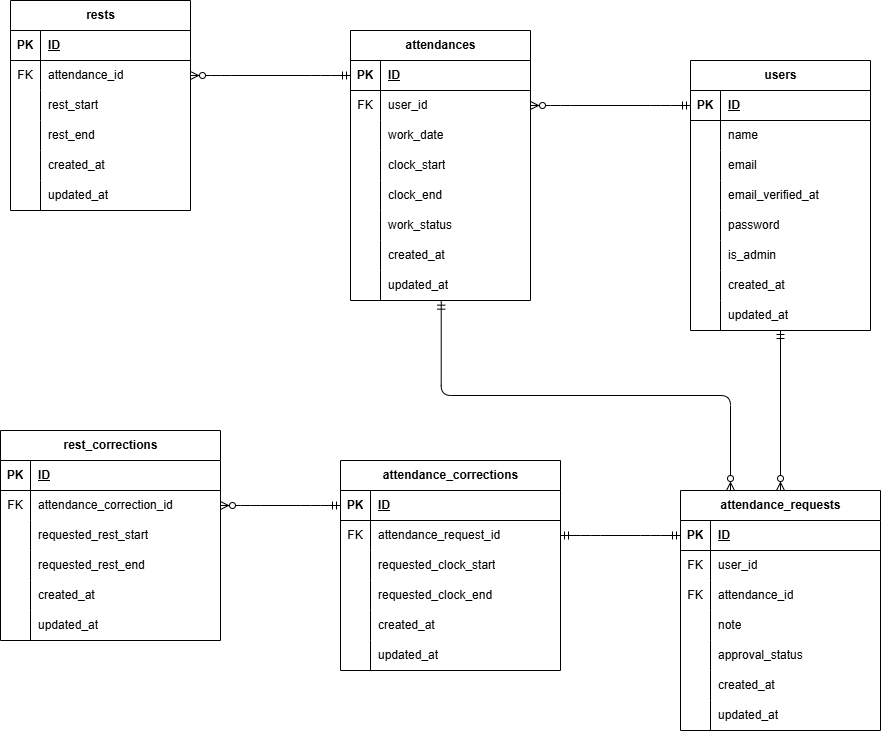

# アプリケーション名
coachtech 勤怠管理アプリ  

## プロジェクトの概要
初年度でのユーザー数1000人達成を目指す、ユーザーの勤怠と管理を行うための勤怠管理アプリを開発する。  

## 環境構築
```  
１）リポジトリからダウンロード  
git clone git@github.com:ayaka-09eng/fuku-attendance-management_project.git  
  
２）srcディレクトリにある「.env.example」をコピーして 「.env」を作成し DBとMAILの設定を変更  
cp .env.example .env  
---  
DB_CONNECTION=mysql  
DB_HOST=mysql  
DB_PORT=3306  
DB_DATABASE=laravel_db  
DB_USERNAME=laravel_user  
DB_PASSWORD=laravel_pass  
  
MAIL_FROM_ADDRESS="example@example.com"  
---  
※.envが保存できない場合は以下コマンドを実行  
docker-compose exec php bash  
chown -R 1000:1000 .env  
  
３）dockerコンテナを構築  
docker-compose up -d --build  
  
４）Laravelをインストール  
docker-compose exec php bash  
composer install  
  
５）アプリケーションキーを作成  
php artisan key:generate  
  
６）DBのテーブルを作成  
php artisan migrate  
  
７）DBのテーブルにダミーデータを投入  
php artisan db:seed  
  
※The stream or file could not be opened"エラーが発生した場合  
srcディレクトリにあるstorageディレクトリに権限を設定  
chmod -R 777 storage  
  
```  

## ログイン情報
【管理者アカウント】  
名前：Admin 001  
メールアドレス：admin001@example.com  
パスワード：password  
  
【一般ユーザーアカウント】  
名前：User 001  
メールアドレス：user001@example.com  
パスワード：password  
  
名前：User 002  
メールアドレス：user002@example.com  
パスワード：password  

## テストの実施方法
```  
１）テスト用のデータベースを作成  
docker-compose exec mysql bash  
mysql -u root -p  
CREATE DATABASE demo_test;  
  
※パスワードはdocker-compose.ymlの「MYSQL_ROOT_PASSWORD:」に記載  
  
２）テスト用のアプリケーションキーを作成  
exit  
exit  
docker-compose exec php bash  
php artisan key:generate --env=testing  
  
３）キャッシュの削除  
php artisan config:clear  
  
４）テスト用のテーブルを作成  
php artisan migrate --env=testing  
  
５）テストの実行  
php artisan test  
```  

## 使用技術(実行環境)
PHP：8.1.34  
Laravel：8.83.8  
MySQL：8.0.26  
Ngnix：1.21.1  

## URL
会員登録：http://localhost/register
ユーザーログイン：http://localhost/login
管理者ログイン：http://localhost/admin/login
phpMyAdmin：http://localhost:8080/  
MailHog：http://localhost:8025/  

## ER図
